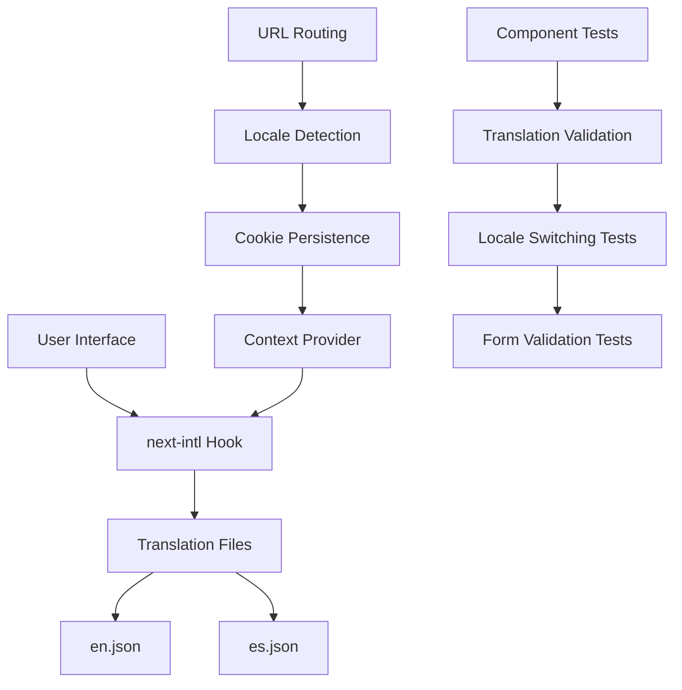

# Design Document

## Overview

El diseño se enfoca en crear un sistema de traducciones robusto y completo para la aplicación web de CECOM. La solución aprovechará next-intl que ya está implementado, pero mejorará la cobertura, consistencia y mantenibilidad de las traducciones. El diseño incluye la refactorización de componentes existentes, la expansión de archivos de traducción, y la implementación de tests comprehensivos.

## Architecture

### Translation System Architecture



### Component Translation Flow

1. **Locale Detection**: El sistema detecta el idioma desde la URL, cookies, o headers del navegador
2. **Context Provision**: El locale se proporciona a través del contexto de next-intl
3. **Component Translation**: Los componentes usan `useTranslations` para obtener textos traducidos
4. **Dynamic Updates**: Los cambios de idioma actualizan todos los componentes reactivamente

## Components and Interfaces

### Translation Hook Interface

```typescript
interface TranslationHook {
  t: (key: string, values?: Record<string, any>) => string;
  locale: 'en' | 'es';
  changeLocale: (locale: 'en' | 'es') => void;
}
```

### Translation File Structure

```typescript
interface TranslationNamespace {
  [key: string]: string | TranslationNamespace;
}

interface TranslationFile {
  Home: TranslationNamespace;
  Header: TranslationNamespace;
  Contact: TranslationNamespace;
  Solutions: TranslationNamespace;
  Alliances: TranslationNamespace;
  AboutUs: TranslationNamespace;
  Catalog: TranslationNamespace;
  Common: TranslationNamespace;
  Validation: TranslationNamespace;
  NotFound: TranslationNamespace;
}
```

### Component Refactoring Strategy

#### 1. Header Component
- **Current Issues**: Funciona correctamente con traducciones
- **Improvements**: Agregar traducciones para accessibility labels y tooltips
- **New Translations**: `Header.accessibility.*`, `Header.tooltips.*`

#### 2. Contact Form Component
- **Current Issues**: Algunos mensajes están hardcodeados
- **Improvements**: Mover todos los mensajes de estado a archivos de traducción
- **New Translations**: `Contact.validation.*`, `Contact.states.*`

#### 3. Catalog Components
- **Current Issues**: Textos hardcodeados en filtros y estados
- **Improvements**: Completar traducciones para todos los estados y mensajes
- **New Translations**: `Catalog.filters.*`, `Catalog.states.*`, `Catalog.navigation.*`

#### 4. Product Components
- **Current Issues**: Falta traducción en modales y navegación
- **Improvements**: Agregar traducciones completas para modales de productos
- **New Translations**: `Catalog.modal.*`, `Catalog.product.*`

## Data Models

### Translation Key Naming Convention

```typescript
// Namespace.Component.Element.State
// Examples:
"Header.navigation.home"
"Contact.form.validation.required"
"Catalog.filter.vendor.placeholder"
"Common.buttons.submit"
"Common.states.loading"
```

### Translation File Organization

```json
{
  "Common": {
    "buttons": {
      "submit": "Submit",
      "cancel": "Cancel",
      "save": "Save",
      "delete": "Delete",
      "edit": "Edit",
      "close": "Close"
    },
    "states": {
      "loading": "Loading...",
      "error": "Error",
      "success": "Success",
      "noData": "No data available"
    },
    "accessibility": {
      "closeModal": "Close modal",
      "openMenu": "Open menu",
      "selectLanguage": "Select language"
    }
  },
  "Validation": {
    "required": "This field is required",
    "email": "Please enter a valid email address",
    "phone": "Please enter a valid phone number",
    "minLength": "Must be at least {min} characters",
    "maxLength": "Must be no more than {max} characters"
  }
}
```

## Error Handling

### Translation Missing Fallbacks

1. **Key Not Found**: Mostrar la clave como fallback con indicador visual en desarrollo
2. **Namespace Missing**: Usar namespace "Common" como fallback
3. **Locale Missing**: Usar inglés como idioma de fallback
4. **File Corruption**: Mostrar mensaje de error y usar cache local

### Error Logging Strategy

```typescript
interface TranslationError {
  type: 'missing_key' | 'missing_namespace' | 'missing_locale';
  key: string;
  namespace: string;
  locale: string;
  component: string;
  timestamp: Date;
}
```

## Testing Strategy

### Unit Tests

#### Translation Hook Tests
- Verificar que `useTranslations` retorna las traducciones correctas
- Probar cambio de idioma y persistencia
- Validar fallbacks cuando faltan traducciones

#### Component Translation Tests
- Renderizar componentes en ambos idiomas
- Verificar que no hay textos hardcodeados
- Probar interpolación de variables en traducciones

### Integration Tests

#### Form Validation Tests
```typescript
describe('Contact Form Translations', () => {
  test('should show validation errors in selected language', () => {
    // Test implementation
  });
  
  test('should submit form with success message in correct language', () => {
    // Test implementation
  });
});
```

#### Catalog Functionality Tests
```typescript
describe('Catalog Translations', () => {
  test('should filter products with translated labels', () => {
    // Test implementation
  });
  
  test('should show loading states in correct language', () => {
    // Test implementation
  });
});
```

### E2E Tests

#### Language Switching Flow
1. Cargar página en inglés
2. Cambiar a español
3. Verificar que toda la UI cambió
4. Navegar entre páginas
5. Verificar persistencia del idioma

#### Complete User Journey Tests
1. Navegación completa del sitio en español
2. Completar formulario de contacto en español
3. Usar catálogo de productos en español
4. Cambiar a inglés y repetir flujo

## Implementation Phases

### Phase 1: Translation File Expansion
- Expandir archivos en.json y es.json con todas las claves necesarias
- Organizar traducciones por namespaces lógicos
- Agregar namespace "Common" y "Validation"

### Phase 2: Component Refactoring
- Refactorizar ContactForm para usar traducciones completas
- Actualizar componentes de catálogo con traducciones faltantes
- Agregar traducciones de accesibilidad al Header

### Phase 3: Test Implementation
- Crear tests unitarios para hooks de traducción
- Implementar tests de componentes con traducciones
- Agregar tests de integración para formularios

### Phase 4: Validation and Quality Assurance
- Ejecutar tests en ambos idiomas
- Validar que no existen textos hardcodeados
- Verificar consistencia entre archivos de traducción

## Performance Considerations

### Translation Loading Strategy
- Cargar solo las traducciones del idioma activo
- Implementar lazy loading para namespaces grandes
- Usar cache del navegador para traducciones

### Bundle Size Optimization
- Separar traducciones por páginas si es necesario
- Comprimir archivos de traducción
- Usar tree-shaking para eliminar traducciones no utilizadas

## Accessibility Improvements

### Screen Reader Support
- Agregar traducciones para todos los `aria-label`
- Traducir textos de `sr-only`
- Asegurar que los cambios de idioma se anuncien

### Keyboard Navigation
- Traducir tooltips de navegación por teclado
- Asegurar que shortcuts funcionen en ambos idiomas
- Traducir mensajes de ayuda contextual