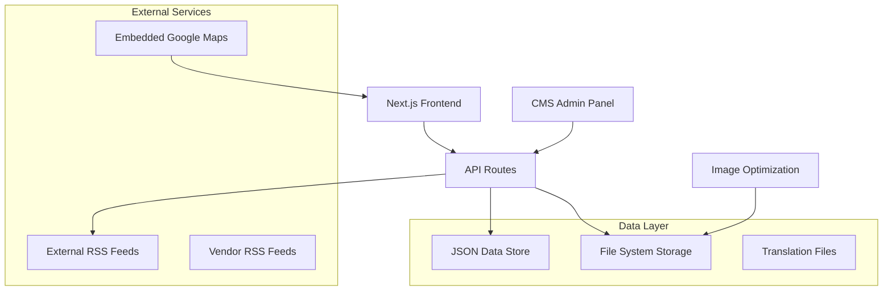

# Design Document

## Overview

This design transforms the existing CECOM Next.js website into a professional platform with a comprehensive product catalog, simple CMS, enhanced content pages, and vendor news feed. The solution leverages the existing Next.js 15 + next-intl architecture while adding new data management capabilities through JSON-based storage and external APIs.

The design prioritizes simplicity, maintainability, and performance while providing a professional user experience. We'll use lightweight libraries and JSON-based data storage to keep the CMS simple and avoid complex database setups.

## Architecture

### High-Level Architecture



### Technology Stack

**Frontend:**
- Next.js 15 with App Router (existing)
- TypeScript (existing)
- Tailwind CSS (existing)
- next-intl for internationalization (existing)
- Radix UI components (existing)
- Lucide React icons (existing)

**New Dependencies:**
- `@tiptap/react` + `@tiptap/starter-kit` - Rich text editor for CMS
- `react-hook-form` + `@hookform/resolvers/zod` - Form handling and validation
- `zod` - Schema validation
- `rss-parser` - RSS feed parsing
- `sharp` - Image optimization (already included in Next.js)

**Data Storage:**
- JSON files for product catalog, categories, and content
- File system for images and media
- No database required for simplicity

## Components and Interfaces

### 1. Product Catalog System

#### Data Models

```typescript
// types/catalog.ts
export interface Category {
  id: string;
  name: {
    en: string;
    es: string;
  };
  description: {
    en: string;
    es: string;
  };
  slug: string;
  order: number;
  icon?: string;
}

export interface Vendor {
  id: string;
  name: string;
  logo: string;
  website?: string;
  rssUrl?: string;
  description: {
    en: string;
    es: string;
  };
}

export interface Product {
  id: string;
  name: {
    en: string;
    es: string;
  };
  description: {
    en: string;
    es: string;
  };
  features: {
    en: string[];
    es: string[];
  };
  categoryId: string;
  vendorId: string;
  image?: string;
  datasheet?: string;
  order: number;
  active: boolean;
}
```

#### Components Structure

```
src/components/catalog/
├── CategorySidebar.tsx          # Category navigation
├── ProductGrid.tsx              # Product listing grid
├── ProductCard.tsx              # Individual product card
├── ProductFilter.tsx            # Search and filter controls
└── ProductModal.tsx             # Product detail modal
```

### 2. Content Management System (CMS)

#### CMS Architecture

```typescript
// types/cms.ts
export interface CMSContent {
  id: string;
  type: 'hero' | 'about' | 'contact' | 'page';
  title: {
    en: string;
    es: string;
  };
  content: {
    en: string;
    es: string;
  };
  images?: string[];
  lastModified: string;
  version: number;
}

export interface CMSUser {
  id: string;
  email: string;
  role: 'admin' | 'editor';
  hashedPassword: string;
}
```

#### CMS Components

```
src/components/cms/
├── AdminLayout.tsx              # CMS layout wrapper
├── ContentEditor.tsx            # Rich text editor
├── ImageUploader.tsx            # Image upload component
├── ContentList.tsx              # Content management list
├── ProductManager.tsx           # Product CRUD interface
├── CategoryManager.tsx          # Category management
└── VendorManager.tsx            # Vendor management
```

### 3. Enhanced Pages

#### About Us Page Structure

```typescript
// types/about.ts
export interface AboutContent {
  mission: {
    en: string;
    es: string;
  };
  vision: {
    en: string;
    es: string;
  };
  values: Array<{
    title: { en: string; es: string };
    description: { en: string; es: string };
    icon: string;
  }>;
  history: {
    en: string;
    es: string;
  };
  team?: Array<{
    name: string;
    position: { en: string; es: string };
    bio: { en: string; es: string };
    image?: string;
  }>;
}
```

#### Contact Page with Embedded Google Maps

```typescript
// components/contact/EmbeddedMap.tsx
interface EmbeddedMapProps {
  address: string;
  embedUrl: string;
  className?: string;
}
```

### 4. News Feed System

#### Feed Data Model

```typescript
// types/feed.ts
export interface NewsArticle {
  id: string;
  title: string;
  summary: string;
  content: string;
  publishedAt: string;
  source: {
    name: string;
    vendorId: string;
    url: string;
  };
  image?: string;
  tags: string[];
}

export interface RSSFeedConfig {
  vendorId: string;
  url: string;
  lastFetched: string;
  active: boolean;
}
```

## Data Models

### File Structure for Data Storage

```
data/
├── catalog/
│   ├── categories.json          # Product categories
│   ├── vendors.json             # Vendor information
│   └── products.json            # Product catalog
├── content/
│   ├── about.json               # About us content
│   ├── hero.json                # Homepage hero content
│   └── contact.json             # Contact page content
├── feeds/
│   ├── config.json              # RSS feed configuration
│   └── articles.json            # Cached news articles
└── cms/
    ├── users.json               # CMS users (hashed passwords)
    └── settings.json            # CMS configuration
```

### Sample Data Structure

```json
// data/catalog/categories.json
[
  {
    "id": "cybersecurity",
    "name": {
      "en": "Cybersecurity",
      "es": "Ciberseguridad"
    },
    "description": {
      "en": "Advanced security solutions to protect your business",
      "es": "Soluciones de seguridad avanzadas para proteger su negocio"
    },
    "slug": "cybersecurity",
    "order": 1,
    "icon": "shield"
  }
]

// data/catalog/products.json
[
  {
    "id": "watchguard-firebox",
    "name": {
      "en": "WatchGuard Firebox T-Series",
      "es": "WatchGuard Firebox Serie T"
    },
    "description": {
      "en": "Next-generation firewall with advanced threat protection",
      "es": "Firewall de próxima generación con protección avanzada contra amenazas"
    },
    "features": {
      "en": [
        "Advanced threat protection",
        "VPN connectivity",
        "Web filtering",
        "Application control"
      ],
      "es": [
        "Protección avanzada contra amenazas",
        "Conectividad VPN",
        "Filtrado web",
        "Control de aplicaciones"
      ]
    },
    "categoryId": "cybersecurity",
    "vendorId": "watchguard",
    "image": "/products/watchguard-firebox.jpg",
    "order": 1,
    "active": true
  }
]
```

## Error Handling

### API Error Handling Strategy

```typescript
// lib/api-error.ts
export class APIError extends Error {
  constructor(
    message: string,
    public statusCode: number = 500,
    public code?: string
  ) {
    super(message);
    this.name = 'APIError';
  }
}

// Centralized error handler for API routes
export function handleAPIError(error: unknown) {
  if (error instanceof APIError) {
    return Response.json(
      { error: error.message, code: error.code },
      { status: error.statusCode }
    );
  }
  
  console.error('Unexpected API error:', error);
  return Response.json(
    { error: 'Internal server error' },
    { status: 500 }
  );
}
```

### Frontend Error Boundaries

```typescript
// components/ErrorBoundary.tsx
export class ErrorBoundary extends Component {
  // Error boundary for catalog and CMS components
  // Graceful fallbacks for failed API calls
  // User-friendly error messages in both languages
}
```

### Data Validation

```typescript
// lib/validation.ts
import { z } from 'zod';

export const ProductSchema = z.object({
  name: z.object({
    en: z.string().min(1),
    es: z.string().min(1)
  }),
  description: z.object({
    en: z.string().min(1),
    es: z.string().min(1)
  }),
  categoryId: z.string(),
  vendorId: z.string(),
  active: z.boolean()
});
```

## Testing Strategy

### Unit Testing

```typescript
// __tests__/components/catalog/ProductCard.test.tsx
// Test product card rendering with different data
// Test internationalization
// Test user interactions

// __tests__/api/catalog.test.ts
// Test API endpoints for CRUD operations
// Test data validation
// Test error handling
```

### Integration Testing

```typescript
// __tests__/integration/catalog-flow.test.tsx
// Test complete catalog browsing flow
// Test category filtering
// Test product search
// Test language switching

// __tests__/integration/cms-flow.test.tsx
// Test CMS authentication
// Test content editing workflow
// Test image upload process
```

### E2E Testing

```typescript
// e2e/catalog.spec.ts (Playwright)
// Test catalog navigation
// Test product filtering and search
// Test responsive design
// Test performance metrics

// e2e/cms.spec.ts
// Test CMS login and content editing
// Test image upload and management
// Test content publishing workflow
```

### Performance Testing

- Lighthouse CI integration for performance monitoring
- Image optimization validation
- RSS feed fetch performance
- API response time monitoring

## API Design

### REST API Endpoints

```typescript
// API Routes Structure
/api/
├── catalog/
│   ├── categories/              # GET, POST, PUT, DELETE
│   ├── products/                # GET, POST, PUT, DELETE
│   ├── vendors/                 # GET, POST, PUT, DELETE
│   └── search/                  # GET with query parameters
├── cms/
│   ├── auth/                    # POST login, DELETE logout
│   ├── content/                 # GET, POST, PUT, DELETE
│   ├── upload/                  # POST for image uploads
│   └── users/                   # GET, POST, PUT, DELETE
├── feed/
│   ├── articles/                # GET with pagination
│   ├── refresh/                 # POST to trigger RSS refresh
│   └── vendors/[id]/articles/   # GET vendor-specific articles

```

### Authentication Strategy

```typescript
// lib/auth.ts
// Simple JWT-based authentication for CMS
// Session management with httpOnly cookies
// Role-based access control (admin/editor)

export interface AuthSession {
  userId: string;
  email: string;
  role: 'admin' | 'editor';
  expiresAt: number;
}
```

## Security Considerations

### CMS Security

- Password hashing with bcrypt
- JWT tokens with short expiration
- CSRF protection for forms
- Input sanitization for rich text content
- File upload validation and scanning

### API Security

- Rate limiting for API endpoints
- Input validation with Zod schemas
- Sanitization of user-generated content
- Secure file upload handling

### Data Protection

- No sensitive data in JSON files
- Environment variables for API keys
- Secure image upload directory
- Regular security audits of dependencies

## Performance Optimizations

### Image Optimization

- Next.js Image component for automatic optimization
- WebP format support with fallbacks
- Lazy loading for product images
- Responsive image sizing

### Caching Strategy

- Static generation for catalog pages
- ISR (Incremental Static Regeneration) for content updates
- Browser caching for static assets
- RSS feed caching with configurable refresh intervals

### Bundle Optimization

- Dynamic imports for CMS components
- Tree shaking for unused code
- Code splitting by route
- Compression for static assets

This design provides a solid foundation for implementing all the required features while maintaining simplicity and performance. The JSON-based approach eliminates the need for a database while still providing a powerful CMS experience.