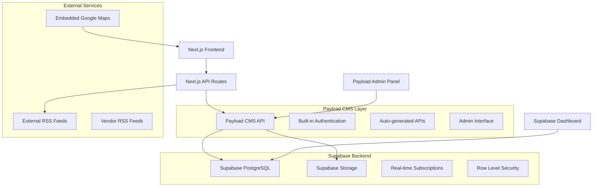

# Design Document

## Overview

This design transforms the existing CECOM Next.js website into a professional platform with a comprehensive product catalog, professional CMS powered by Payload, enhanced content pages, and vendor news feed. The solution leverages the existing Next.js 15 + next-intl architecture while integrating Payload CMS for robust content management and API generation.

The design prioritizes professional functionality, maintainability, and performance while providing an enterprise-grade user experience. We'll use Payload CMS to eliminate the need for custom API development and provide a sophisticated admin interface out of the box.

## Architecture

### High-Level Architecture



### Technology Stack

**Frontend:**
- Next.js 15 with App Router (existing)
- TypeScript (existing)
- Tailwind CSS (existing)
- next-intl for internationalization (existing)
- Radix UI components (existing)
- Lucide React icons (existing)

**New Dependencies:**
- `payload` - Headless CMS with admin panel and API generation
- `@payloadcms/bundler-webpack` - Webpack bundler for Payload
- `@payloadcms/db-postgres` - PostgreSQL adapter for Payload (Supabase)
- `@payloadcms/richtext-slate` - Rich text editor for Payload
- `@supabase/supabase-js` - Supabase client for additional features
- `rss-parser` - RSS feed parsing
- `pg` - PostgreSQL client

**Data Storage:**
- Supabase PostgreSQL database managed by Payload CMS
- Supabase Storage for images and media
- Automatic API generation through Payload
- Built-in admin interface and authentication
- Optional Supabase Auth integration

## Components and Interfaces

### 1. Product Catalog System

#### Payload Collections Configuration with Supabase

```typescript
// payload.config.ts
import { buildConfig } from 'payload/config'
import { postgresAdapter } from '@payloadcms/db-postgres'

export default buildConfig({
  db: postgresAdapter({
    pool: {
      connectionString: process.env.SUPABASE_DATABASE_URL,
    },
  }),
  collections: [
    {
      slug: 'categories',
      admin: {
        useAsTitle: 'name',
      },
      fields: [
        {
          name: 'name',
          type: 'text',
          required: true,
          localized: true,
        },
        {
          name: 'description',
          type: 'textarea',
          localized: true,
        },
        {
          name: 'slug',
          type: 'text',
          required: true,
          unique: true,
        },
        {
          name: 'order',
          type: 'number',
          defaultValue: 0,
        },
        {
          name: 'icon',
          type: 'text',
        },
      ],
    },
    {
      slug: 'vendors',
      admin: {
        useAsTitle: 'name',
      },
      fields: [
        {
          name: 'name',
          type: 'text',
          required: true,
        },
        {
          name: 'logo',
          type: 'upload',
          relationTo: 'media',
        },
        {
          name: 'website',
          type: 'text',
        },
        {
          name: 'rssUrl',
          type: 'text',
        },
        {
          name: 'description',
          type: 'textarea',
          localized: true,
        },
      ],
    },
    {
      slug: 'products',
      admin: {
        useAsTitle: 'name',
      },
      fields: [
        {
          name: 'name',
          type: 'text',
          required: true,
          localized: true,
        },
        {
          name: 'description',
          type: 'richText',
          localized: true,
        },
        {
          name: 'features',
          type: 'array',
          localized: true,
          fields: [
            {
              name: 'feature',
              type: 'text',
            },
          ],
        },
        {
          name: 'category',
          type: 'relationship',
          relationTo: 'categories',
          required: true,
        },
        {
          name: 'vendor',
          type: 'relationship',
          relationTo: 'vendors',
          required: true,
        },
        {
          name: 'image',
          type: 'upload',
          relationTo: 'media',
        },
        {
          name: 'datasheet',
          type: 'upload',
          relationTo: 'media',
        },
        {
          name: 'order',
          type: 'number',
          defaultValue: 0,
        },
        {
          name: 'active',
          type: 'checkbox',
          defaultValue: true,
        },
      ],
    },
  ],
  localization: {
    locales: ['en', 'es'],
    defaultLocale: 'en',
  },
  upload: {
    limits: {
      fileSize: 5000000, // 5MB
    },
  },
  // Optional: Custom upload handler for Supabase Storage
  onInit: async (payload) => {
    // Initialize Supabase client for additional features
    const { createClient } = await import('@supabase/supabase-js')
    const supabase = createClient(
      process.env.NEXT_PUBLIC_SUPABASE_URL!,
      process.env.SUPABASE_SERVICE_ROLE_KEY!
    )
    payload.supabase = supabase
  },
})
```

#### Components Structure

```
src/components/catalog/
├── CategorySidebar.tsx          # Category navigation
├── ProductGrid.tsx              # Product listing grid
├── ProductCard.tsx              # Individual product card
├── ProductFilter.tsx            # Search and filter controls
└── ProductModal.tsx             # Product detail modal
```

### 2. Payload CMS Integration

#### Payload Collections for Content Management

```typescript
// Additional Payload collections for content management
{
  slug: 'pages',
  admin: {
    useAsTitle: 'title',
  },
  fields: [
    {
      name: 'title',
      type: 'text',
      required: true,
      localized: true,
    },
    {
      name: 'slug',
      type: 'text',
      required: true,
      unique: true,
    },
    {
      name: 'content',
      type: 'richText',
      localized: true,
    },
    {
      name: 'type',
      type: 'select',
      options: ['hero', 'about', 'contact', 'page'],
      required: true,
    },
    {
      name: 'images',
      type: 'array',
      fields: [
        {
          name: 'image',
          type: 'upload',
          relationTo: 'media',
        },
      ],
    },
  ],
},
{
  slug: 'news-articles',
  admin: {
    useAsTitle: 'title',
  },
  fields: [
    {
      name: 'title',
      type: 'text',
      required: true,
    },
    {
      name: 'summary',
      type: 'textarea',
    },
    {
      name: 'content',
      type: 'richText',
    },
    {
      name: 'publishedAt',
      type: 'date',
      required: true,
    },
    {
      name: 'vendor',
      type: 'relationship',
      relationTo: 'vendors',
    },
    {
      name: 'sourceUrl',
      type: 'text',
    },
    {
      name: 'image',
      type: 'upload',
      relationTo: 'media',
    },
    {
      name: 'tags',
      type: 'array',
      fields: [
        {
          name: 'tag',
          type: 'text',
        },
      ],
    },
  ],
}
```

#### Frontend Integration Components

```
src/components/payload/
├── PayloadProvider.tsx          # Payload API context provider
├── PayloadImage.tsx             # Optimized image component for Payload uploads
└── PayloadRichText.tsx          # Rich text renderer for Payload content

src/lib/payload/
├── api.ts                       # Payload API integration functions
├── types.ts                     # TypeScript types for Payload collections
└── utils.ts                     # Utility functions for Payload data

src/lib/supabase/
├── client.ts                    # Supabase client configuration
├── storage.ts                   # Supabase Storage utilities
└── types.ts                     # Generated TypeScript types from Supabase
```

### Supabase Integration Benefits

#### MCP Supabase Integration
- **Kiro MCP Server** - Direct integration with Supabase through Model Context Protocol
- **Project Management** - Create and manage Supabase projects directly from Kiro
- **Database Operations** - Execute SQL queries and manage schema through MCP
- **Storage Management** - Create buckets and manage files through MCP tools

#### Database Schema
- **PostgreSQL** - Relational database with ACID compliance
- **Auto-generated types** - TypeScript types from database schema
- **Row Level Security** - Built-in security policies
- **Real-time subscriptions** - Live updates for admin panel

#### Storage Integration
```typescript
// lib/supabase/storage.ts
import { createClient } from '@supabase/supabase-js'

const supabase = createClient(
  process.env.NEXT_PUBLIC_SUPABASE_URL!,
  process.env.NEXT_PUBLIC_SUPABASE_ANON_KEY!
)

export const uploadFile = async (file: File, bucket: string, path: string) => {
  const { data, error } = await supabase.storage
    .from(bucket)
    .upload(path, file)
  
  if (error) throw error
  return data
}

export const getPublicUrl = (bucket: string, path: string) => {
  const { data } = supabase.storage
    .from(bucket)
    .getPublicUrl(path)
  
  return data.publicUrl
}
```

### 3. Enhanced Pages

#### About Us Page Structure

```typescript
// types/about.ts
export interface AboutContent {
  mission: {
    en: string;
    es: string;
  };
  vision: {
    en: string;
    es: string;
  };
  values: Array<{
    title: { en: string; es: string };
    description: { en: string; es: string };
    icon: string;
  }>;
  history: {
    en: string;
    es: string;
  };
  team?: Array<{
    name: string;
    position: { en: string; es: string };
    bio: { en: string; es: string };
    image?: string;
  }>;
}
```

#### Contact Page with Embedded Google Maps

```typescript
// components/contact/EmbeddedMap.tsx
interface EmbeddedMapProps {
  address: string;
  embedUrl: string;
  className?: string;
}
```

### 4. News Feed System

#### Feed Data Model

```typescript
// types/feed.ts
export interface NewsArticle {
  id: string;
  title: string;
  summary: string;
  content: string;
  publishedAt: string;
  source: {
    name: string;
    vendorId: string;
    url: string;
  };
  image?: string;
  tags: string[];
}

export interface RSSFeedConfig {
  vendorId: string;
  url: string;
  lastFetched: string;
  active: boolean;
}
```

## Data Models

### File Structure for Data Storage

```
data/
├── catalog/
│   ├── categories.json          # Product categories
│   ├── vendors.json             # Vendor information
│   └── products.json            # Product catalog
├── content/
│   ├── about.json               # About us content
│   ├── hero.json                # Homepage hero content
│   └── contact.json             # Contact page content
├── feeds/
│   ├── config.json              # RSS feed configuration
│   └── articles.json            # Cached news articles
└── cms/
    ├── users.json               # CMS users (hashed passwords)
    └── settings.json            # CMS configuration
```

### Sample Data Structure

```json
// data/catalog/categories.json
[
  {
    "id": "cybersecurity",
    "name": {
      "en": "Cybersecurity",
      "es": "Ciberseguridad"
    },
    "description": {
      "en": "Advanced security solutions to protect your business",
      "es": "Soluciones de seguridad avanzadas para proteger su negocio"
    },
    "slug": "cybersecurity",
    "order": 1,
    "icon": "shield"
  }
]

// data/catalog/products.json
[
  {
    "id": "watchguard-firebox",
    "name": {
      "en": "WatchGuard Firebox T-Series",
      "es": "WatchGuard Firebox Serie T"
    },
    "description": {
      "en": "Next-generation firewall with advanced threat protection",
      "es": "Firewall de próxima generación con protección avanzada contra amenazas"
    },
    "features": {
      "en": [
        "Advanced threat protection",
        "VPN connectivity",
        "Web filtering",
        "Application control"
      ],
      "es": [
        "Protección avanzada contra amenazas",
        "Conectividad VPN",
        "Filtrado web",
        "Control de aplicaciones"
      ]
    },
    "categoryId": "cybersecurity",
    "vendorId": "watchguard",
    "image": "/products/watchguard-firebox.jpg",
    "order": 1,
    "active": true
  }
]
```

## Error Handling

### API Error Handling Strategy

```typescript
// lib/api-error.ts
export class APIError extends Error {
  constructor(
    message: string,
    public statusCode: number = 500,
    public code?: string
  ) {
    super(message);
    this.name = 'APIError';
  }
}

// Centralized error handler for API routes
export function handleAPIError(error: unknown) {
  if (error instanceof APIError) {
    return Response.json(
      { error: error.message, code: error.code },
      { status: error.statusCode }
    );
  }
  
  console.error('Unexpected API error:', error);
  return Response.json(
    { error: 'Internal server error' },
    { status: 500 }
  );
}
```

### Frontend Error Boundaries

```typescript
// components/ErrorBoundary.tsx
export class ErrorBoundary extends Component {
  // Error boundary for catalog and CMS components
  // Graceful fallbacks for failed API calls
  // User-friendly error messages in both languages
}
```

### Data Validation

```typescript
// lib/validation.ts
import { z } from 'zod';

export const ProductSchema = z.object({
  name: z.object({
    en: z.string().min(1),
    es: z.string().min(1)
  }),
  description: z.object({
    en: z.string().min(1),
    es: z.string().min(1)
  }),
  categoryId: z.string(),
  vendorId: z.string(),
  active: z.boolean()
});
```

## Testing Strategy

### Unit Testing

```typescript
// __tests__/components/catalog/ProductCard.test.tsx
// Test product card rendering with different data
// Test internationalization
// Test user interactions

// __tests__/api/catalog.test.ts
// Test API endpoints for CRUD operations
// Test data validation
// Test error handling
```

### Integration Testing

```typescript
// __tests__/integration/catalog-flow.test.tsx
// Test complete catalog browsing flow
// Test category filtering
// Test product search
// Test language switching

// __tests__/integration/cms-flow.test.tsx
// Test CMS authentication
// Test content editing workflow
// Test image upload process
```

### E2E Testing

```typescript
// e2e/catalog.spec.ts (Playwright)
// Test catalog navigation
// Test product filtering and search
// Test responsive design
// Test performance metrics

// e2e/cms.spec.ts
// Test CMS login and content editing
// Test image upload and management
// Test content publishing workflow
```

### Performance Testing

- Lighthouse CI integration for performance monitoring
- Image optimization validation
- RSS feed fetch performance
- API response time monitoring

## API Design

### Payload Auto-Generated API Endpoints

```typescript
// Payload automatically generates these REST API endpoints:
/api/
├── categories/                  # GET, POST, PUT, DELETE (auto-generated by Payload)
├── products/                    # GET, POST, PUT, DELETE (auto-generated by Payload)
├── vendors/                     # GET, POST, PUT, DELETE (auto-generated by Payload)
├── pages/                       # GET, POST, PUT, DELETE (auto-generated by Payload)
├── news-articles/               # GET, POST, PUT, DELETE (auto-generated by Payload)
├── media/                       # GET, POST, PUT, DELETE (auto-generated by Payload)
└── users/                       # GET, POST, PUT, DELETE (auto-generated by Payload)

// Custom API routes for specific functionality:
/api/custom/
├── search/                      # GET with query parameters (uses Payload queries)
├── feed/
│   ├── refresh/                 # POST to trigger RSS refresh and update Payload
│   └── sync/                    # POST to sync RSS articles to Payload collections
```

### Payload Authentication Strategy

```typescript
// Payload handles authentication automatically
// Built-in JWT-based authentication
// Role-based access control through Payload collections
// Session management handled by Payload

// payload.config.ts
export default buildConfig({
  admin: {
    user: 'users',
    meta: {
      titleSuffix: '- CECOM Admin',
    },
  },
  collections: [
    {
      slug: 'users',
      auth: {
        tokenExpiration: 7200, // 2 hours
      },
      fields: [
        {
          name: 'role',
          type: 'select',
          options: ['admin', 'editor'],
          defaultValue: 'editor',
          required: true,
        },
      ],
    },
  ],
})
```

## Security Considerations

### Supabase Security

- **Row Level Security (RLS)** - Database-level access control
- **JWT tokens** - Secure authentication with automatic refresh
- **API keys** - Separate keys for public and service role access
- **HTTPS only** - All connections encrypted

### Payload CMS Security

- **Built-in authentication** - Secure admin access
- **Input validation** - Automatic sanitization
- **File upload security** - Type validation and size limits
- **CSRF protection** - Built-in security measures

### MCP Supabase Configuration

```json
// ~/.kiro/settings/mcp.json
{
  "mcpServers": {
    "supabase": {
      "command": "uvx",
      "args": ["mcp-server-supabase"],
      "env": {
        "SUPABASE_ACCESS_TOKEN": "your_supabase_access_token",
        "SUPABASE_PROJECT_REF": "your_project_reference"
      },
      "disabled": false,
      "autoApprove": [
        "create_project",
        "create_bucket",
        "execute_sql",
        "list_tables"
      ]
    }
  }
}
```

### Environment Variables

```bash
# Supabase Configuration (obtained through MCP)
NEXT_PUBLIC_SUPABASE_URL=your_supabase_project_url
NEXT_PUBLIC_SUPABASE_ANON_KEY=your_supabase_anon_key
SUPABASE_SERVICE_ROLE_KEY=your_supabase_service_role_key
SUPABASE_DATABASE_URL=postgresql://postgres:[password]@[host]:5432/postgres

# Payload CMS Configuration
PAYLOAD_SECRET=your_payload_secret_key
PAYLOAD_CONFIG_PATH=src/payload.config.ts

# MCP Supabase Configuration
SUPABASE_ACCESS_TOKEN=your_supabase_access_token
SUPABASE_PROJECT_REF=your_project_reference

# Optional: Additional security
NEXTAUTH_SECRET=your_nextauth_secret
NEXTAUTH_URL=http://localhost:3000
```

### Data Protection

- **Environment variables** for all sensitive configuration
- **Supabase RLS policies** for data access control
- **Secure file upload** through Supabase Storage
- **Regular security audits** of dependencies

## Performance Optimizations

### Image Optimization

- Next.js Image component for automatic optimization
- WebP format support with fallbacks
- Lazy loading for product images
- Responsive image sizing

### Caching Strategy

- Static generation for catalog pages
- ISR (Incremental Static Regeneration) for content updates
- Browser caching for static assets
- RSS feed caching with configurable refresh intervals

### Bundle Optimization

- Dynamic imports for CMS components
- Tree shaking for unused code
- Code splitting by route
- Compression for static assets

This design provides a solid foundation for implementing all the required features while maintaining simplicity and performance. The JSON-based approach eliminates the need for a database while still providing a powerful CMS experience.